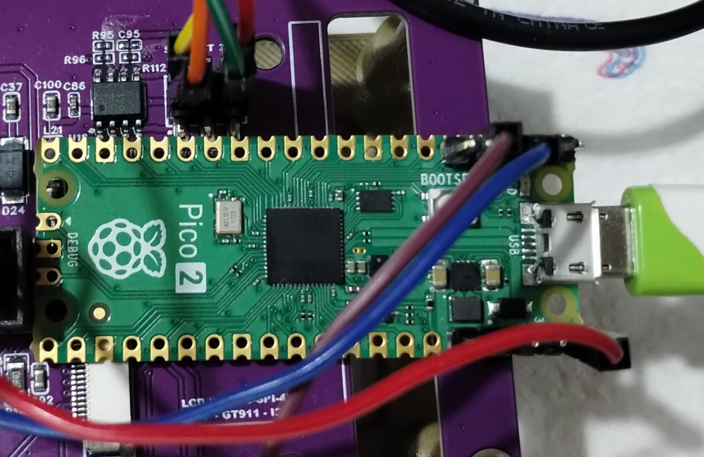
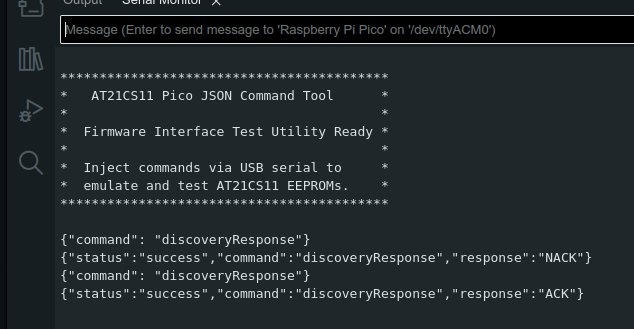
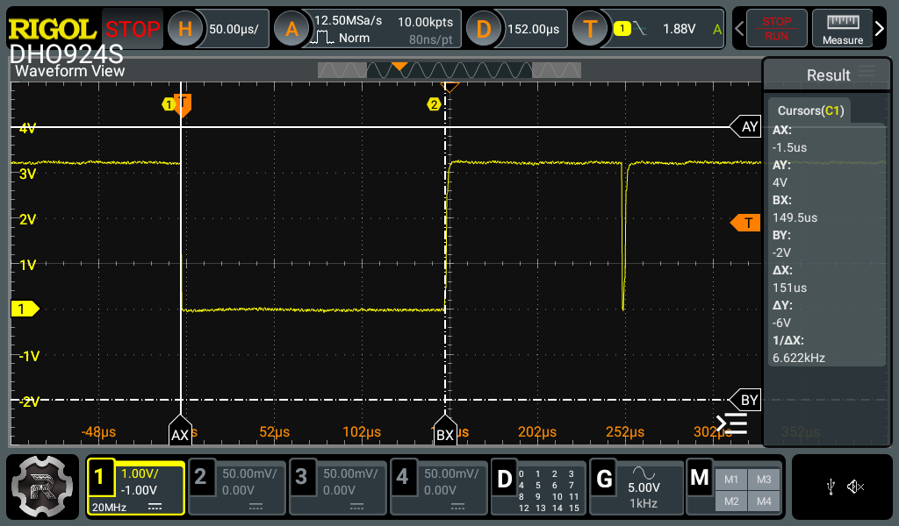
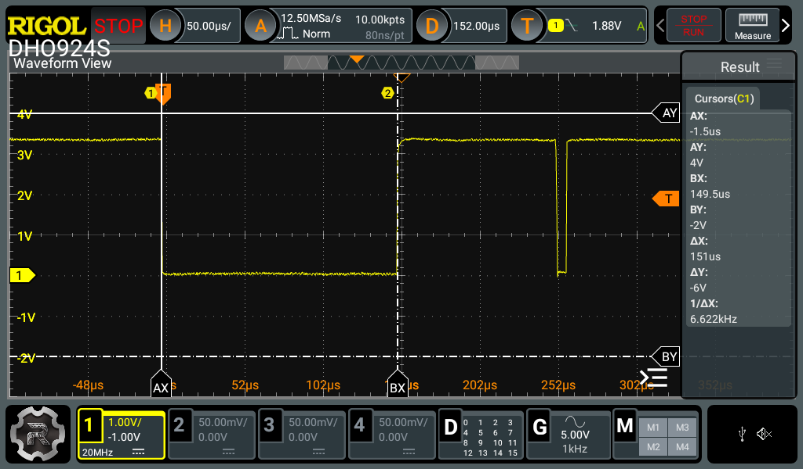
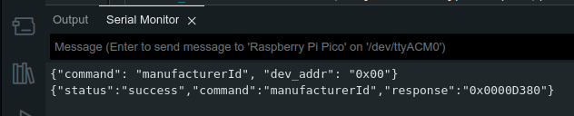
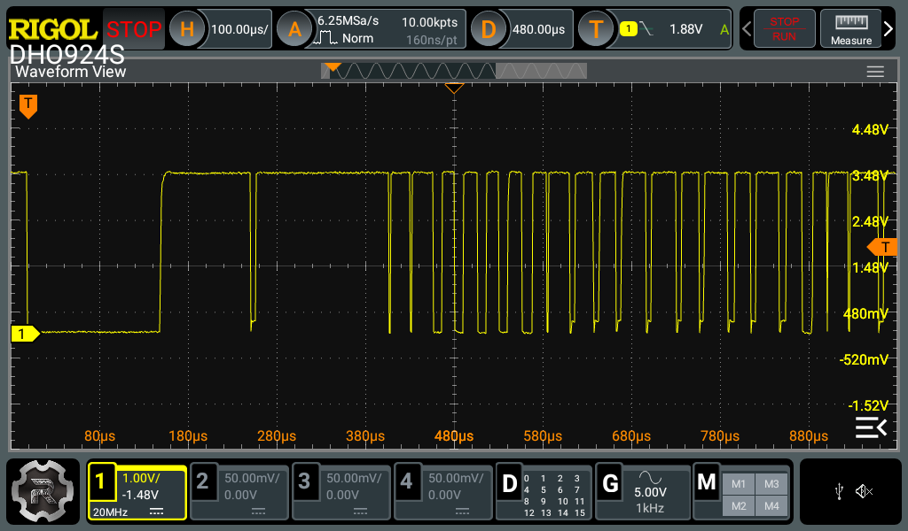
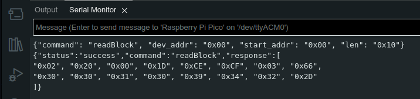

# ⚙️ PicoSWITool

A firmware tool 🛠️ for testing SWI (Single-Wire Interface) EEPROM emulators, specifically designed for the AT21CS11. This tool runs on Raspberry Pi Pico boards (RP2350 and RP2040) and facilitates sending commands and receiving responses to verify the functionality of an EEPROM emulation.

## 📑 Table of Contents

* [✨ Features](#features)
* [💾 Hardware Requirements](#hardware-requirements)
* [💻 Software Requirements](#software-requirements)
* [🛠️ Installation](#installation)
    * [Prerequisites](#prerequisites)
    * [1\. Fetch the Pico SDK](#1-fetch-the-pico-sdk)
    * [2\. Set the `PICO_SDK_PATH` Environment Variable](#2-set-the-pico_sdk_path-environment-variable)
    * [3\. Clone & Build the PicoSWITool Project](#3-clone--build-the-picoswitool-project)
    * [4\. Flashing the UF2 File to Your Raspberry Pi Pico](#4-flashing-the-uf2-file-to-your-raspberry-pi-pico)
* [💡 Usage](#usage)
    * [JSON Command Format](#json-command-format)
    * [Command Details](#command-details)
* [💡 Examples of Use](#examples-of-use)
* [⚙️ Implementation Details](#implementation-details)
* [⏱️ Timing](#timing)
* [📜 License](#license)
* [🤝 Contributing](#contributing)
* [✍️ Author](#author)

<a name="features"></a>
## ✨ Features

* Sends commands to an SWI EEPROM emulator.
* Receives and parses responses.
* Supports various AT21CS11 commands (discovery, read/write, etc.).
* Utilizes the RP2350's dual-core architecture for efficient timing and USB communication.
* Communicates via USB serial using JSON commands.
* Provides feedback via JSON responses.
* Provides a command-line interface via USB serial to interact with the EEPROM.

---

<a name="hardware-requirements"></a>
## 💾 Hardware Requirements

* Raspberry Pi Pico 2 (RP2350) or Raspberry Pi Pico (RP2040)



* Device with an AT21CS11 SWI EEPROM interface or an [emulator](https://github.com/jjsch-dev/at21cs11-eeprom-emulator/) of it.

---

<a name="software-requirements"></a>
## 💻 Software Requirements

* Raspberry Pi Pico [SDK](https://github.com/raspberrypi/pico-sdk)
* ARM GCC compiler [Toolchain](https://developer.arm.com/Tools%20and%20Software/GNU%20Toolchain)

<a name="installation"></a>
## 🛠️ Installation

This guide outlines the steps to set up the development environment and build the PicoSWITool project on Ubuntu 24.04.

### Prerequisites

On Ubuntu 24.04, install the required packages:

```bash
sudo apt update
sudo apt install -y \
    git cmake build-essential libstdc++-arm-none-eabi-newlib \
    gcc-arm-none-eabi python3-pip python3-venv
```
* `git`, `cmake`, `build-essential`: For cloning the repository and building the CMake project.

* `gcc-arm-none-eabi` & `libstdc++-arm-none-eabi-newlib`: The ARM GCC compiler and C library necessary for building firmware for the Raspberry Pi Pico.

* `python3-pip` & `python3-venv`: Required by the Pico SDK's build system.

### 1\. Fetch the Pico SDK

The Raspberry Pi Pico SDK provides the necessary libraries and build tools.

```bash
# Choose your workspace directory (you can adjust this path)
cd ~/development
```

```bash
# Clone the Pico SDK repository from GitHub
git clone [https://github.com/raspberrypi/pico-sdk.git](https://github.com/raspberrypi/pico-sdk.git)
cd pico-sdk
```

```bash
# Initialize and update the submodules within the Pico SDK
git submodule update --init
```

### 2\. Set the `PICO_SDK_PATH` Environment Variable

CMake needs to know the location of the Pico SDK. You need to set the `PICO_SDK_PATH` environment variable. It's recommended to add this to your shell startup file (e.g., `~/.bashrc` for Bash) so it's set automatically in new terminal sessions.

To add the `PICO_SDK_PATH`, you can use the `echo` command:

```bash
echo "export PICO_SDK_PATH=~/development/pico-sdk" >> ~/.bashrc
```

After adding this line, you need to reload your shell configuration or apply the change to your current session by sourcing the `~/.bashrc` file:

```bash
source ~/.bashrc
```

To verify that the variable is set correctly, run:

```bash
echo $PICO_SDK_PATH
```

It should output the path to your Pico SDK directory (`~/development/pico-sdk`).

### 3\. Clone & Build the PicoSWITool Project

Now, you can clone and build the PicoSWITool project.

```bash
# Go back to your workspace
cd ~/development
```

```bash
# Clone the PicoSWITool repository from GitHub
git clone https://github.com/jjsch-dev/PicoSWITool.git
```

```bash
# Navigate into the project directory
cd PicoSWITool
```

```bash
# Create a build directory and enter it
mkdir build && cd build
```

```bash
# Configure the build for your Raspberry Pi Pico board:
# For the original Pico 2 (RP2350, 150 MHz Cortex-M33 - Note: Check your specific board)
cmake -DPICO_BOARD=pico2 ..
```
```bash
# Or for the Raspberry Pi Pico 2 (RP2040, 125 MHz Cortex-M0+)
# cmake -DPICO_BOARD=pico ..
```

```bash
# Or for the Raspberry Pi Pico W / Pico H (RP2040 with wireless)
# cmake -DPICO_BOARD=pico_w ..
```

```bash
# Build the project using multiple parallel jobs for faster compilation.
# '$(nproc)' will automatically be replaced by the number of CPU cores\.
make -j$(nproc)
```

If the build is successful, you should see output similar to:

```bash
[100%] Built target pico_swi_tool
```

The firmware file (`pico_swi_tool.uf2`) will be located in the `build` directory.

### 4\. Flashing the UF2 File to Your Raspberry Pi Pico

To run the firmware on your Pico:

1.  Connect your Raspberry Pi Pico to your computer via USB while holding down the **BOOTSEL** button on the Pico board.
2.  The Pico will enumerate as a USB mass storage device (usually named `RPI-RP2`).
3.  **Choose the appropriate UF2 file for your Pico board and copy it to the `RPI-RP2` drive:**
    * **Raspberry Pi Pico (RP2040):** You can download the pre-built UF2 file [here](bin/pico1_swi_tool.uf2). Copy `pico1_swi_tool.uf2` to the `RPI-RP2` drive.
    * **Raspberry Pi Pico 2 (RP2350):** You can download the pre-built UF2 file [here](bin/pico2_swi_tool.uf2). Copy `pico2_swi_tool.uf2` to the `RPI-RP2` drive.
    *(Note: If you built the project yourself, the UF2 file will also be available in the `build/` directory as `pico_swi_tool.uf2`.)*
4.  Once the copy is complete, the board will automatically reboot and start running your firmware.

### Troubleshooting

* **`PICO_SDK_PATH` not set:** Double-check that the `export PICO_SDK_PATH=...` line in your shell startup file correctly points to the location where you cloned the Pico SDK. Ensure you have sourced the file or restarted your terminal.
* **Compiler errors about missing headers:** Verify the output of the `cmake` command. It should indicate the board configuration being used (e.g., "Using board configuration from .../boards/pico.h" or "boards/pico2.h"). If it's not finding the board configuration, there might be an issue with the `PICO_SDK_PATH` or the `cmake` command itself.
* **Performance/timing off (for Pico 2):** If you are using a Raspberry Pi Pico 2 (RP2350 with Cortex-M33), ensure you configured the build with the appropriate `-DPICO_BOARD` flag (e.g., `-DPICO_BOARD=pico2`). Also, be aware that timing-sensitive code might need adjustments for the different core speed.

With these steps, you should have a fully set up development environment and be able to build and flash the PicoSWITool firmware to your Raspberry Pi Pico.

---

<a name="usage"></a>
## 💡 Usage

The tool communicates via USB serial. Send JSON-formatted commands to the Pico, and it will respond with JSON-formatted responses.

### JSON Command Format

Commands are sent as JSON objects with a `"command"` field and any necessary data fields.

### Command Details

Here's a breakdown of the supported commands:

#### 🔍 `discoveryResponse`
Performs the SWI EEPROM discovery response sequence. This command triggers a series of pin toggles on the Pico to simulate the EEPROM's response to a discovery request. The master device (your testing setup) typically sends a general bus call after a reset to identify any connected devices on the SWI bus. If a device is present, it should send the ACK sequence.

* Command:
```json
{"command": "discoveryResponse"}
```
* Response: 
```json
{"status": "success", "command": "discoveryResponse", "response": "ACK"} or 
{"status": "success", "command": "discoveryResponse", "response": "NACK"}
```
### ➡️ `txByte`
Transmits a single byte to the SWI EEPROM emulator. This command sends the provided byte bit-by-bit, utilizing specific functions (`tx_one()` or `tx_zero()`) to represent each bit's value on the SWI bus. After the byte transmission is complete, the tool reads the response from the emulator, which should be an ACK (acknowledgement) indicating successful reception or a NACK (not acknowledgement) indicating an error.

* Command:
```json 
{"command": "txByte", "data": "0x55"}
(Replace "0x55" with the byte value to transmit in hexadecimal format.)
```
* Response: 
```json
{"status": "success", "command": "txByte", "response": "ACK"} or 
{"status": "success", "command": "txByte", "response": "NACK"}
```

### ⬅️ `rxByte`
Receives a single byte from the SWI EEPROM emulator. This command reads 8 consecutive bits from the SWI bus, utilizing a bit reading function (`read_bit()`). The function handles the necessary pin toggling and precise timing required by the SWI protocol to correctly sample each bit from the EEPROM interface. These 8 bits are then combined to form the received byte, which is included in the response.

* Command: 
```json
{"command": "rxByte"}
```
* Response: 
```json
{"status": "success", "command": "rxByte", "response": "0xYY"} 
(where 0xYY is the received byte)
```

###  🆔 `manufacturerId`
Retrieves the manufacturer and device identification code from the SWI EEPROM emulator. The response provides a unique code, such as `0x00D200` for the AT21CS01 or `0x00D380` for the AT21CS11. This command internally uses a sequence of lower-level SWI operations, including discovery, byte transmission (`txByte`), and byte reception (`rxByte`), to construct the necessary communication to obtain this ID. A response of zero typically indicates an error or that no device responded.

* Command: 
```json
{"command": "manufacturerId", "dev_addr": "0x00"}
```
* Response: 
```json
{"status": "success", "command": "manufacturerId", "response": "0x00XXXX"} 
(e.g., 0x00D200 for AT21CS01, 0x00D380 for AT21CS11) or 
{"status":"error","command":"manufacturerId","response":"Error: Manufacturer ID is zero"}
```

###  📚 `readBlock`
Reads a block of data from the SWI EEPROM emulator. This command retrieves a specified number of bytes from the EEPROM, starting at a given address. It performs several checks and operations to ensure reliable data retrieval:

* **Address Validation:** It verifies that the requested memory block (defined by the starting address and length) does not exceed the valid memory range of the EEPROM (0-127 in this example).
* **Presence Check:** It initiates an EEPROM discovery sequence to confirm that the EEPROM emulator is present and responding on the SWI bus.
* **Verified Reading:** It employs a verified read procedure, where each byte is read from the EEPROM multiple times to ensure data integrity.

* `dev_addr`: The device address for EEPROM access.
* `start_addr`: The starting address in the EEPROM (0-127).
* `len`: The number of bytes to read.

The command returns the requested block of data.

* Command: 
```json
{"command": "readBlock", "dev_addr": "0x00", "start_addr": "0x00", "len": "0x10"}
```
* Response: 
```json
{"status":"success","command":"readBlock","response":["0xXX", "0xXX", ...]}
```
---

<a name="examples-of-use"></a>
## 💡 Examples of Use

This section demonstrates how to interact with the PicoSWITool using JSON commands via the USB serial interface.

### Discovery Response Example

The `discoveryResponse` command tests the EEPROM emulator's response to a discovery sequence.

**Scenario:** Sending a discovery command to the PicoSWITool.

**Command Sent (via USB Serial):**

```json
{"command": "discoveryResponse"}
```

**Observed Responses (in Arduino IDE 2.0 Serial Monitor):**



The PicoSWITool sends a reset pulse (approx. 150µs). The emulator's reply might be:

**Negative Acknowledge (NACK):**

The oscilloscope capture below shows the reset pulse generated by the Pico and the NACK:


```json
{"status": "success", "command": "discoveryResponse", "response": "NACK"}
```

This indicates the emulator did not acknowledge the discovery request.

**Acknowledge (ACK):**

The oscilloscope capture below shows the reset pulse generated by the Pico and the ACK:


```json
{"status": "success", "command": "discoveryResponse", "response": "ACK"}
```

Sending `{"command": "discoveryResponse"}` repeatedly helps test the emulator's reliability.

---

### Manufacturer ID Example

The `manufacturerId` command retrieves the unique identification code of the connected EEPROM emulator. This example demonstrates sending the command and interpreting a typical response.

**Scenario:** Requesting the manufacturer and device ID of the EEPROM emulator.

**Command Sent (via USB Serial):**

```json
{"command": "manufacturerId", "dev_addr": "0x00"}
```

**Observed Response (in Arduino IDE 2.0 Serial Monitor - as seen in image):**



The PicoSWITool will send a sequence of SWI commands to the EEPROM emulator to retrieve its ID. A successful response will look similar to this:

```json
{"status": "success", "command": "manufacturerId", "response": "0x00D380"}
```

In this example, the response `0x00D380` indicates an AT21CS11 EEPROM device. The oscilloscope capture in Image likely shows the low-level SWI communication occurring during this command execution.



**Interpreting the Response:**

* The `response` field contains the manufacturer and device ID.
* `0x00D200` typically identifies an AT21CS01 EEPROM.
* `0x00D380` typically identifies an AT21CS11 EEPROM.
* A response of `{"status":"error","command":"manufacturerId","response":"Error: Manufacturer ID is zero"}` or a similar error message indicates that the command failed or the device did not respond correctly.

This example illustrates how to use the `manufacturerId` command and interpret the returned identification code.

---

### Read Block Example

The `readBlock` command allows you to read a sequence of bytes from a specified memory address in the EEPROM emulator. This example demonstrates how to request a block of data and interpret the response.

**Scenario:** Reading 16 bytes (0x10) starting from address 0x00 of the EEPROM emulator on device address 0x00.

**Command Sent (via USB Serial):**

```json
{"command": "readBlock", "dev_addr": "0x00", "start_addr": "0x00", "len": "0x10"}
```

**Observed Response (in Arduino IDE 2.0 Serial Monitor - as seen in Image):**



The PicoSWITool will send a sequence of SWI commands to the EEPROM emulator to read the requested block of data. A successful response will contain an array of hexadecimal byte values:

```json
{"status":"success","command":"readBlock","response":["0x02", "0x20", "0x00", "0x1D", "0xCE", "0xCF", "0x03", "0x66", "0x30", "0x30", "0x31", "0x30", "0x39", "0x34", "0x32", "0x2D"]}
```

The `response` field is an array where each element represents a byte read from the EEPROM, in the order of the requested addresses. The oscilloscope capture in Image likely shows the low-level SWI communication occurring during the execution of this command, including address transmission and data reception.


**Interpreting the Response:**

In this example, the PicoSWITool successfully read 16 bytes starting from address `0x00`. The returned array contains these 16 bytes in hexadecimal format. You can compare these values to the expected data in your EEPROM emulator.

This example illustrates how to use the `readBlock` command to retrieve a contiguous block of data for verification.

---

<a name="implementation-details"></a>
## ⚙️ Implementation Details

* The project is built using the Raspberry Pi Pico 2 SDK and targets the RP2350 microcontroller.
* **⏱️ Timing Considerations:**
    * While the Raspberry Pi Pico's PIO (Programmable Input/Output) units 🕹️ offer the capability to generate precise bit-bang timing, this project utilizes software-based delays ⏳ for greater flexibility during testing. This allows for easier adjustment of timing parameters to accommodate different EEPROM devices or emulation scenarios.
    * Precise timing is achieved on Core 1 using the `soft_delay_us()` function ⚙️. This function employs cycle counting to introduce delays in microseconds, taking into account the Pico's clock speed.
    * The delay is calculated based on the following:
        * For the Pico 2 (150 MHz), each CPU cycle is approximately 6.67 ns.
        * For the Pico 1 (125 MHz), each CPU cycle is approximately 8 ns.
    * The `soft_delay_us()` function includes a calibration constant (currently -7) that may need to be fine-tuned 🛠️ for specific hardware setups to achieve the most accurate timing.
* **Dual-Core Operation:**
    * Core 0 handles the USB communication ↔️ and parsing of JSON commands.
    * Core 1 is dedicated to the precise timing required for the SWI communication, using the `multicore_fifo_push_blocking()` and `multicore_fifo_pop_blocking()` functions for inter-core communication.
    * The decision to offload low-level SWI tasks to Core 1 was made to **minimize the risk of IRQ interruptions** that could disrupt critical timing. For example, during command execution:
      ```c
      uint32_t irq_status = save_and_disable_interrupts();
      switch (cmd) {
          case TX_BYTE:
              ack = tx_byte(data);
              break;
          case DISCOVERY:
              ack = discovery_response();
              break;
          case RX_BYTE:
              ack = rx_byte(data);
              break;
          default:
              ack = 0xFF;  // Unknown command error.
              break;
      }
      restore_interrupts(irq_status);
      ```
      *Disabling interrupts during these sections ensures accurate signal timing for reliable SWI emulation.*
* **SWI Emulation:** The SWI communication is implemented using open-drain GPIO control 🔌. The `sio_set_high()` function sets the GPIO pin to input mode (high), and `sio_set_low()` sets it to output mode (low).
* **JSON Parsing:** The [jsmn](https://github.com/zserge/jsmn) library — a lightweight, minimalistic JSON parser in C — is used to parse incoming JSON commands 🧾. The `jsoneq()` function is used to compare JSON tokens.
* **Building:** The `CMakeLists.txt` file 🧱 defines the build process, including setting compiler flags and linking libraries.

---

<a name="timing"></a>
## ⏱️ Timing

The code includes timing constants optimized for SWI communication. These constants may need to be adjusted based on the specific EEPROM device or emulator being used. The code defines different timing presets (Prusa, Atmel Standard, Atmel High Speed).
```c
#define T_PRUSA_LOW1_US   2
#define T_PRUSA_LOW0_US   10
#define T_PRUSA_RD_US     1
// ...
```

---

<a name="license"></a>
## 📜 License

[MIT License](LICENSE) – © jjsch-dev (2025)

You can freely use and modify this code as long as you include the original license.

<a name="contributing"></a>
## 🧑‍💻 Contributing

For contributions or improvements:
- Fork the project
- Create a new branch
- Submit a pull request

Or open issues or feature requests directly on the repository.

---

<a name="author"></a>
## 📬 Contact & Credits

- **Author**: jjsch-dev  
- **Repository**: [GitHub Link](https://github.com/jjsch-dev/PicoSWITool)

---
